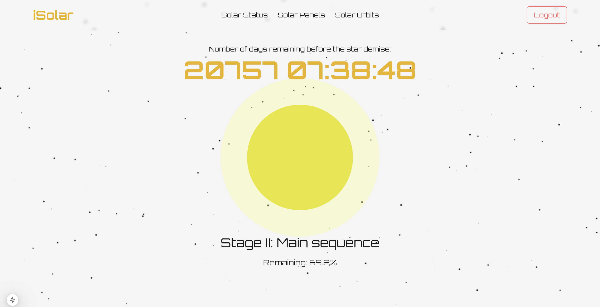
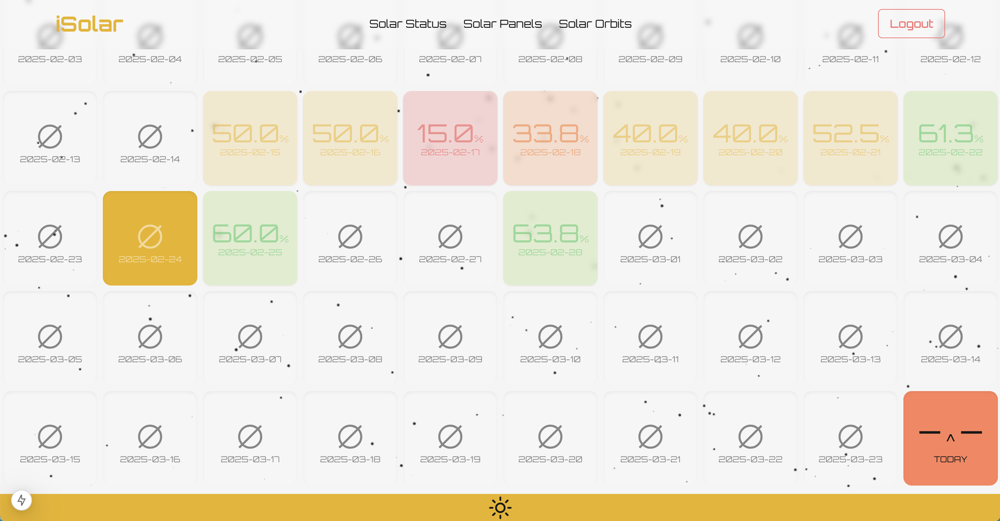
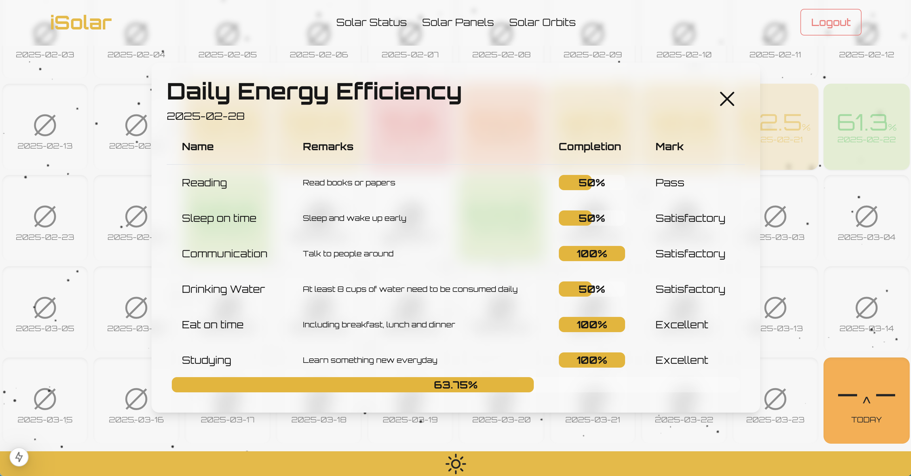
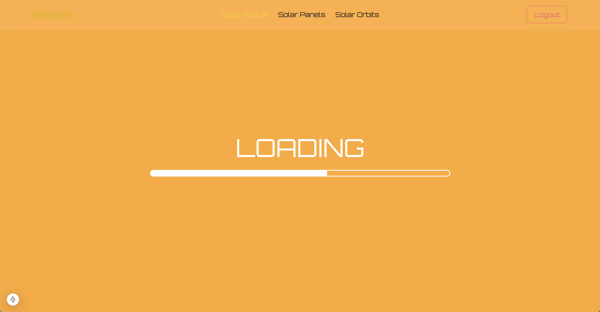

# iSolar: A New Way to Motivate Your Life by Visualization of Your Lifespan

## What is iSolar


LifeStar is a unique application designed to inspire self-improvement, self-monitoring, and self-reflection by offering a profound perspective on the finite nature of human life.

Unlike traditional time or schedule management apps, iSolar doesn’t focus on organizing your tasks or managing your daily routine. Instead, it serves as a gentle but powerful reminder of life’s fleeting nature, encouraging users to live more intentionally and meaningfully.

Through a metaphorical representation of human life as a star, the app visually and numerically illustrates how much of your life is behind you and how much remains ahead. Just as a star shines brightly before it fades, LifeStar motivates users to make the most of their remaining time and reflect on how they are living.


## Who Is It For?

- Individuals seeking personal growth and self-awareness.
- Those who want to reflect on their existence and make the most of their time.
- People who feel overwhelmed by routine and want to reconnect with their purpose.
- Anyone looking for a unique perspective on life and time management.

## Getting Started

Firstly, download and install MySQL

Secondly, create a database named "Selfware"

Thirdly, create necessary tables:

```sql
CREATE TABLE `cubes` (
  `id` int NOT NULL AUTO_INCREMENT,
  `userId` varchar(255) NOT NULL,
  `name` varchar(255) NOT NULL,
  `date` varchar(255) DEFAULT NULL,
  `percentage` float NOT NULL,
  `status` enum('OPENING','CLOSED') NOT NULL,
  PRIMARY KEY (`id`),
  UNIQUE KEY `date` (`date`),
  CONSTRAINT `cubes_chk_1` CHECK (((`percentage` >= 0) and (`percentage` <= 100)))
) ENGINE=InnoDB AUTO_INCREMENT=55 DEFAULT CHARSET=utf8mb4 COLLATE=utf8mb4_0900_ai_ci;
```

```sql
CREATE TABLE `users` (
  `id` int NOT NULL AUTO_INCREMENT,
  `username` varchar(50) NOT NULL,
  `email` varchar(255) NOT NULL,
  `password` varchar(255) NOT NULL,
  `profile_picture` varchar(255) DEFAULT NULL,
  `contact` varchar(15) DEFAULT NULL,
  `gender` enum('Male','Female','Other') DEFAULT NULL,
  `date_of_birth` date DEFAULT NULL,
  `bio` text,
  PRIMARY KEY (`id`)
) ENGINE=InnoDB AUTO_INCREMENT=4 DEFAULT CHARSET=utf8mb4 COLLATE=utf8mb4_0900_ai_ci;
```

```sql
CREATE TABLE `tasks` (
  `id` int NOT NULL AUTO_INCREMENT,
  `user_id` int NOT NULL,
  `name` varchar(255) NOT NULL,
  `date` date NOT NULL,
  `remarks` text,
  `completion` enum('0%','50%','100%') DEFAULT '0%',
  `mark` enum('Failure','Pass','Satisfactory','Good','Excellent') DEFAULT NULL,
  PRIMARY KEY (`id`),
  KEY `user_id` (`user_id`),
  CONSTRAINT `tasks_ibfk_1` FOREIGN KEY (`user_id`) REFERENCES `Users` (`id`) ON DELETE CASCADE
) ENGINE=InnoDB AUTO_INCREMENT=44 DEFAULT CHARSET=utf8mb4 COLLATE=utf8mb4_0900_ai_ci;
```

Finally, run the development server:

```bash
npm run dev
# or
yarn dev
# or
pnpm dev
# or
bun dev
```

Open [http://localhost:3000](http://localhost:3000) with your browser to use the application.
